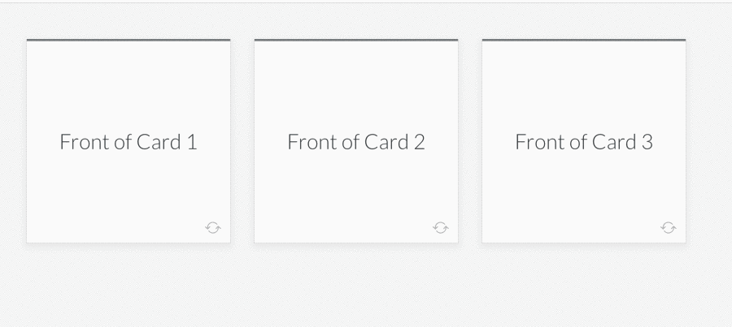

Gif of a screenrecording of the components in action^

## Flashcards Block Components

This is my submission for the Articulate Developer Challenge.
I picked the Flashcards block mostly because I loved the flipping card animation - admittedly, this is a fairly shallow way of making a choice but hey! it works :) 

## Methodology

I was short on time this week - I had alot of work to do for my job and I didn't get to work on this until a few hours ago. So instead of trying to be too creative, I made it my goal to replicate the example as much as possible by using the pre-existing css classes when possible.

## Project Structure

Dummy JSON data is found in the file "dummyData.json"
This is imported in the main APP.js file where it is converted into amn array of JavaScript objects that is passed to the Flashcards component as a prop. The Flashcards component takes the array of objects and uses the map function to generate a list of individual Flashcard components, each which takes an object from the array as a prop.
The Flashcard component takes the props and renders them although it also has a state which keeps track of whether the card has been flipped or not. The Flashcards component could be made stateless as it's just passing data and there's no logic involved. 
